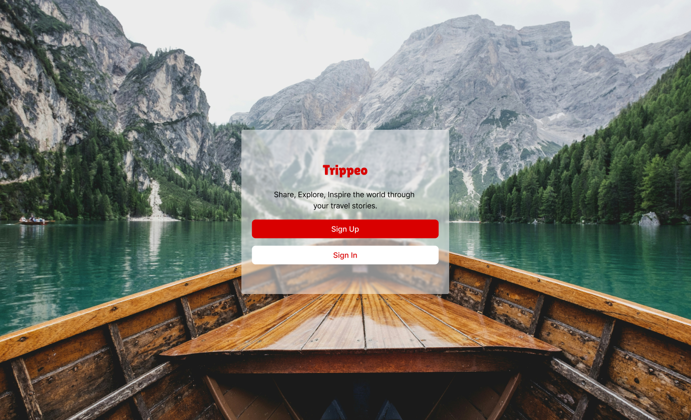
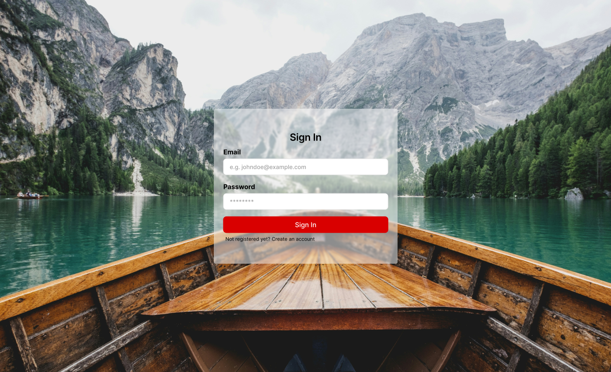
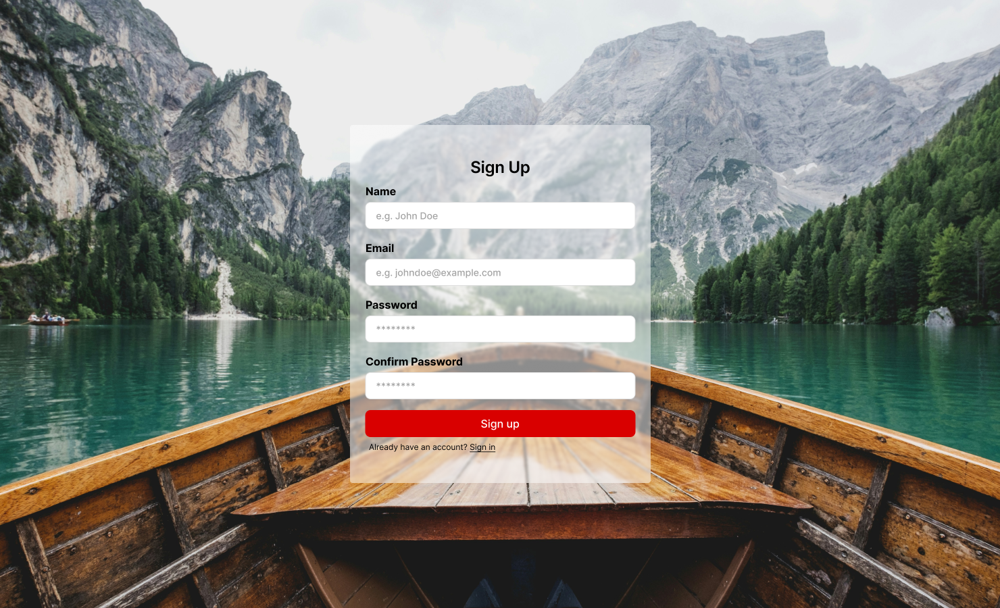
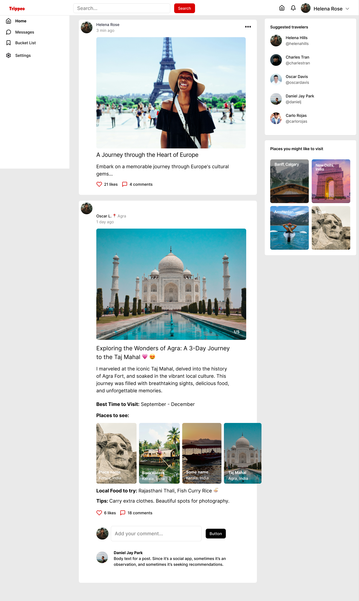
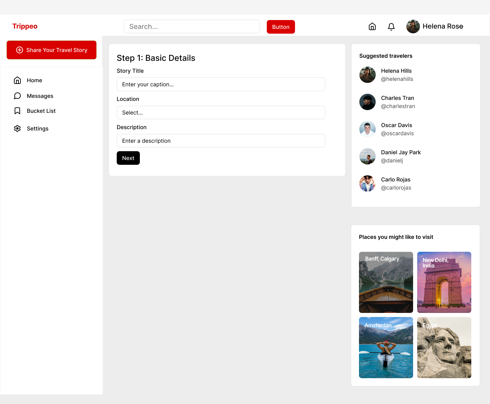
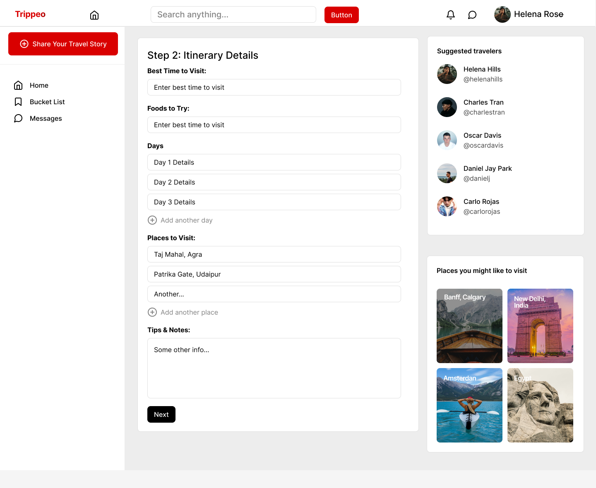
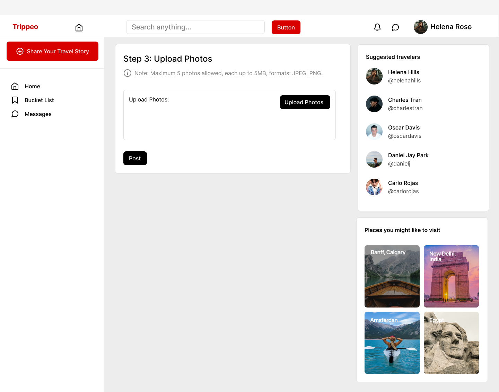
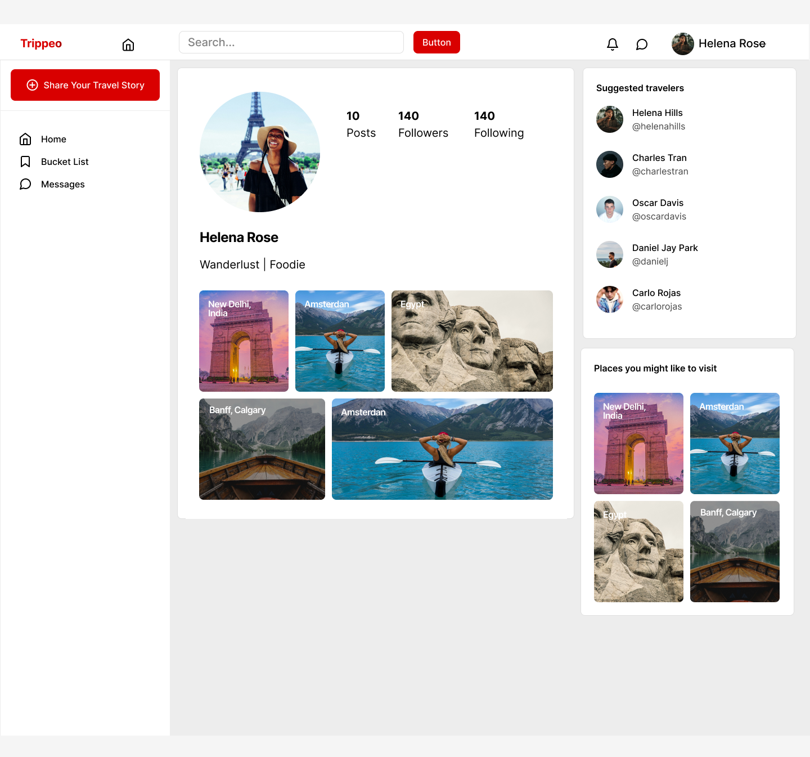
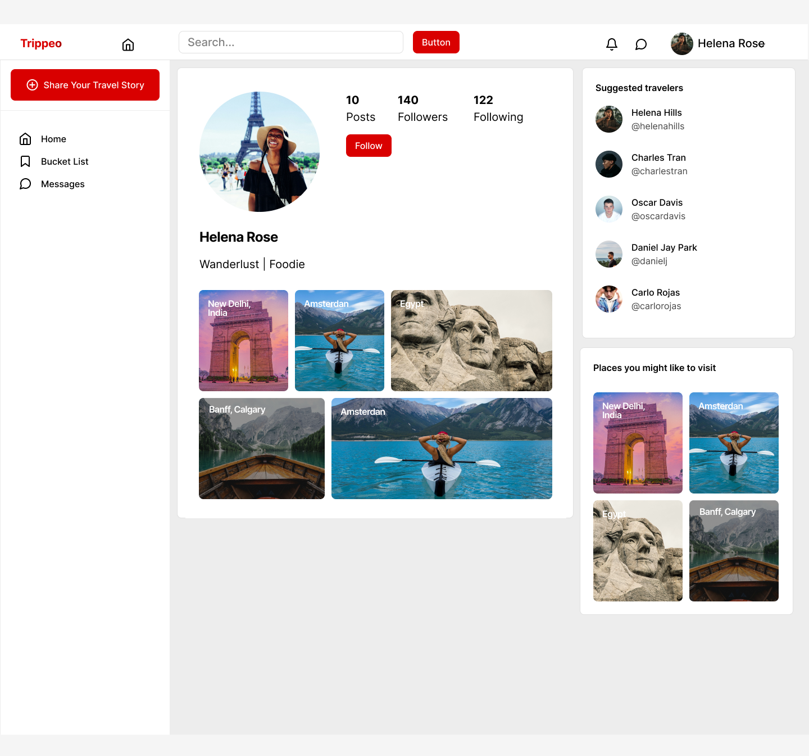
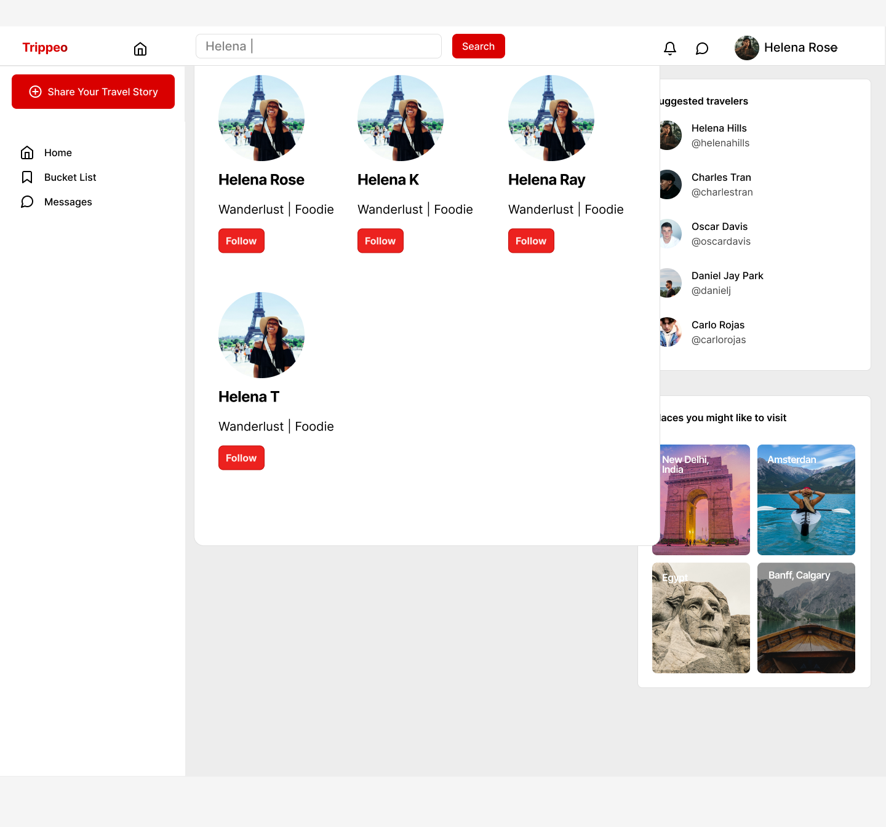

# TripPeo

_Share, Explore, Inspire through your travel stories._

Pronounced as Trippy (Trips and People)

## Overview

**TripPeo** is a specialized social media platform designed for travel enthusiasts to share their travel experiences, discover new destinations, and connect with like-minded travelers. This app provides users with tools to document their trips, including photos, itineraries, and personal tips, while fostering a community of passionate travelers.

### Problem

TripPeo aims to address several key needs and challenges faced by travelers, making it a valuable tool for a wide audience. Here are the reasons why such an app is needed:

1. **Scattered Travel Documentation**: Currently, travelers often document their trips across multiple platforms (social media, personal blogs, and others), leading to scattered content that's hard to manage and revisit.

2. **Lack of a Dedicated Travel Community**: General social media platforms are not specifically designed for travel enthusiasts, making it difficult for travelers to connect and share relevant content.

3. **Difficulty in Trip Planning and Inspiration**: Finding reliable travel information and inspiration for new trips amidst the vast amount of content online can be time-consuming, often requiring visits to multiple websites and forums.

4. **Limited Access to Local Insights**: Travelers often miss out on authentic local experiences and tips that can significantly enhance their trips, relying instead on generic travel guides or incomplete information.

TripPeo addresses these challenges by offering a single platform where travelers can:

- Consolidate all their travel experiences in one place, making it easy to manage and share their experiences.
- Access comprehensive travel posts with detailed itineraries, tips, and recommendations, streamlining the trip planning process.
- Engage with a dedicated community of like-minded travelers, facilitating meaningful connections and the exchange of valuable insights.
- Discover authentic local insights and tips shared by fellow travelers, enriching their travel experiences with insider knowledge.

By focusing on these pain points, TripPeo aims to simplify and enhance the overall travel experience, making it more enjoyable, organized, and connected for users worldwide.

### User Profile

TripPeo is designed for a diverse range of users who are passionate about travel and seek a comprehensive platform to document, share, and discover travel experiences.

1. **Travel Enthusiasts**: Individuals who travel frequently or aspire to travel more and want to document trips with photos, descriptions, itineraries, and tips.

2. **Trip Planners**: Users seeking for inspiration and practical information for upcoming trips.

3. **Local Experts**: Residents or frequent visitors of specific destinations who want to share insider tips, local foods, attractions, and cultural insights with others.

4. **Community Seekers**: Users interested in connecting with like-minded travelers, exchange stories, tips, and advice.

_Usage Scenarios_:

- Users will create detailed posts about their travel experiences, including photos, descriptions, itineraries, and tips.
- Users will browse travel posts from travelers they follow to find inspiration.
- Users will interact with other travelers by liking posts, following accounts, and leaving comments.

_Special Considerations_:

- Ensuring user privacy and implementing safety measures to protect users' personal information and travel plans.

### Features

1.  User Registration and Authentication:

    **User Story**: As a user, I want to sign up for an account using my email and basic information, so that I can create a profile and use the app.

    **Details**: Fields for username email, password, and profile picture. Enable login/logout functionality.

2.  Creating Travel Stories:

    **User Story**: As a user, I want to create and share travel stories, so that I can document my experiences and share them with others.

    **Details**: Fields for title, location, detailed descriptions, day-by-day itinerary, foods to try, best time to visit, places to visit, tips, and up to 5 photos.

3.  Viewing Travel Stories:

    **User Story**: As a user, I want to view travel stories created by others, so that I can get inspiration and learn from their experiences.

    **Details**: Display travel stories with all details, including photos and itineraries.

4.  Commenting:

    **User Story**: As a user, I want to comment on travel stories, so that I can engage with the content and share my thoughts.

    **Details**: Fields for commenting on travel stories.

5.  View Other User Profiles:

    **User Story**: As a user, I want to view other user profiles so that I can follow them or check their travel stories.

    **Details**: Display other user's profile picture, stories, followers, following count.

6.  Following and Unfollowing Users:

    **User Story**: As a user, I want to follow or unfollow other users, so that I can keep up with their travel posts or stop seeing their updates.

    **Details**: Follow/unfollow buttons on user profiles and posts.

7.  Search Functionality:

    **User Story**: As a user, I want to search for users, so that I can follow them.

    **Details**: Search bar with filter by user names functionality.

## Implementation

### Tech Stack

- **Front-end**:

  - React.js: For building the user interface.
  - Sass: For powerful and maintainable stylesheets.
  - Axios: For making HTTP requests.
  - Material-UI: For UI icons.
  - Mapbox: For location selection.
  - Multer: For image upload handling.

- Back-end:

  - Node.js and Express.js: For building the APIs.
  - JWT (JSON Web Tokens): For securing API endpoints and user sessions.
  - Mongoose: For handling database connection with MongoDB.

- Database:
  - MongoDB: For storing user data, travel story details, comments, and other details.

### APIs

- Mapbox: For location selection and other related functionalities.

### Sitemap

1. **Welcome Page**: Shows the Sign In/Sign Up buttons with info about the web application.

2. **Login Page**: Allows users to log into their accounts.

3. **Register Page**: Allows new users to sign up for an account.

4. **User Profile Page**: Displays user information (profile picture, bio, etc.). Shows user’s travel stories.

5. **Home Page (Feed)**: Displays a feed of all travel stories from users the current user follows. Includes comment functionalities. Navigation bar shows Search bar to search for other users.

6. **Create Travel Story Page**: Form for users to create a new travel story with all the specified fields.

7. **Other User's Profile Page**: Displays user information (profile picture, bio, etc.). Shows user’s travel stories. Follow/Unfollow buttons.

8. **404 Not Found Page**: Displayed when a user navigates to a non-existent page.

### Mockups

#### Welcome Page



---

#### Login Page



---

#### Register Page



---

#### Home Page (Feed)



---

#### Create Travel Story Page

- Step 1



- Step 2



- Step 3



---

#### Profile Page



---

#### Other User's Profile Page



---

#### Search Component



---

### Data

**User Entity**:

- Attributes: username, email, password, profile_picture, followers, following
- Manages user information, authentication, followers, and following relationships.

**TravelStory Entity**:

- Attributes: user, title, location, description, itinerary, foods_to_try, best_time_to_visit, places_to_visit, tips, photos, comments
- TravelStory: Manages travel stories with fields for details and comments.

**Relationships**:

User to TravelStory (One-to-Many):

- A user can create multiple travel stories.

User to User (Many-to-Many, Followers):

- Users can follow each other (self-referencing), creating a many-to-many relationship.

User to TravelStory (Many-to-Many, Comments):

- Users can comment on multiple travel stories, and a travel story can have comments from multiple users.
- Comments can be embedded within the TravelStory schema as subdocuments.

### Endpoints

#### 1. Register User

- **Request**

  - Method: `POST`
  - Endpoint: `/auth/register`
  - Description: Register a new user.
  - Headers:
    - `Content-Type: application/json`
  - Body:
    ```json
    {
      "username": "Jane Doe",
      "email": "jane.doe@example.com",
      "password": "Test@123",
      "confirm_password": "Test@123"
    }
    ```

- **Response**
  - Status: `201 Created`
  - Body:
    ```json
    {
      "message": "User registered successfully",
      "user": {
        "id": 1
      }
    }
    ```

#### 2. Login User

- **Request**

  - Method: `POST`
  - Endpoint: `/auth/login`
  - Description: Login a user and generate a token.
  - Headers:
    - `Content-Type: application/json`
  - Body:
    ```json
    {
      "email": "jane.doe@example.com",
      "password": "Test@123"
    }
    ```

- **Response**

  - Status: `200 Ok`
  - Body:
    ```json
    {
      "token": "{token}",
      "username": John Doe,
      "userId": 1,
    }
    ```

#### 3. Get the authenticated user's profile

- **Request**

  - Method: `GET`
  - Endpoint: `/auth/profile`
  - Description: Get the authenticated user's profile.
  - Headers:
    - `Content-Type: application/json`
    - `Authorization: Bearer {token}`

- **Response**

  - Status: `200 Ok`
  - Body:
    ```json
    {
      "id": 1,
      "username": "Jane Doe",
      "email": "jane.doe@example.com",
      "bio": "Travel Influencer",
      "location": "Toronto, ON",
      "profilePicture": "url_to_profile_picture",
      "followers": [],
      "following": [],
      "travelStoriesCount": 10,
      "stories": {
        "id": 1,
        "title": "6 places to see the Northern Lights in Europe",
        "photos": ["url_to_photo1", "url_to_photo2"],
        "created_at": "2023-06-28T10:00:00.000Z",
        "updated_at": "2023-07-01T10:00:00.000Z"
      }
    }
    ```

#### 4. Creating Travel Stories

- **Request**

  - Method: `POST`
  - Endpoint: `/stories`
  - Description: Create a new travel story.
  - Headers:
    - `Content-Type: application/json`
    - `Authorization: Bearer {token}`
  - Body:

    ```json
    {
      "title": "6 places to see the Northern Lights in Europe",
      "description": "Theres never been a better time to see Aurora Borealis, with more destinations experiencing them than ever and  trip options ranging from self-guided adventures on the Shetland Islands to Icelandic fjord cruises.",
      "best_time": "December",
      "places_to_visit": ["Ilulissat, Greenland", "Shetland, Scotland"],
      "photos": [
        {
          "photo_url": "/images/northern-lights.jpg"
        },
        {
          "photo_url": "/images/aurora.jpg"
        }
      ],
      "notes": ":Greenland Travel offers a four-night New Year’s Eve package for those wishing to experience polar activity like a local.",
      "local_food": "",
      "itinerary": [
        {
          "day": 1,
          "content": "Flight to Europe, Stay at Hotel Romania"
        },
        {
          "day": 2,
          "content": "Visit Ilulissat, Greenland"
        }
      ]
    }
    ```

- **Response**

  - Status: `201 Created`
  - Body:
    ```json
    {
      "message": "Travel story created successfully",
      "story": {
        "id": 1
      }
    }
    ```

#### 5. Get all travel stories

- **Request**

  - Method: `GET`
  - Endpoint: `/stories`
  - Description: Get a list of all travel stories.
  - Headers:
    - `Content-Type: application/json`
    - `Authorization: Bearer {token}`

- **Response**

  - Status: `200 Ok`
  - Body:
    ```json
    {
      "stories": [
        {
          "id": 1,
          "title": "6 places to see the Northern Lights in Europe",
          "location": "Europe",
          "description": "Theres never been a better time to see Aurora Borealis, with more destinations experiencing them than ever and trip options ranging from self-guided adventures on the Shetland Islands to Icelandic fjord cruises.",
          "best_time": "December",
          "places_to_visit": ["Ilulissat, Greenland", "Shetland, Scotland"],
          "photos": ["url_to_photo1", "url_to_photo2"],
          "notes": ":Greenland Travel offers a four-night New Year’s Eve package for those wishing to experience polar activity like a local.",
          "local_food": "",
          "itinerary": [
            {
              "day": 1,
              "content": "Flight to Europe, Stay at Hotel Romania"
            },
            {
              "day": 2,
              "content": "Visit Ilulissat, Greenland"
            }
          ],
          "created_at": "2023-06-28T10:00:00.000Z",
          "updated_at": "2023-07-01T10:00:00.000Z"
        }
      ]
    }
    ```

#### 6. Get a single travel story details

- **Request**

  - Method: `GET`
  - Endpoint: `/stories/:storyId`
  - Description: Get the authenticated user's profile.
  - Headers:
    - `Content-Type: application/json`
    - `Authorization: Bearer {token}`

- **Response**

  - Status: `200 Ok`
  - Body:
    ```json
    {
      "id": 1,
      "user": {
        "id": 1,
        "username": "travel_lover",
        "profile_picture": "url_to_profile_photo"
      },
      "title": "Exploring the Alps",
      "location": "Swiss Alps",
      "description": "A detailed account of my adventure in the Swiss Alps.",
      "itinerary": [
        {
          "day": 1,
          "content": "Hiking"
        },
        {
          "day": 2,
          "content": "Snorkeling"
        }
      ],
      "foods_to_try": "Swiss chocolate, Fondue",
      "best_time_to_visit": "Summer",
      "places_to_visit": "Zermatt, Jungfraujoch",
      "tips": "Pack warm clothes, stay hydrated",
      "photos": ["url_to_photo1", "url_to_photo2"],
      "comments": [
        {
          "user": {
            "id": 1,
            "username": "mountain_enthusiast"
          },
          "comment": "Amazing story! Thanks for sharing.",
          "createdAt": "2023-07-01T10:00:00.000Z"
        }
      ],
      "createdAt": "2023-06-28T10:00:00.000Z",
      "updatedAt": "2023-07-01T10:00:00.000Z"
    }
    ```

#### 7. Add a comment to a travel story

- **Request**

  - Method: `POST`
  - Endpoint: `/stories/:storyId/comments`
  - Description: Add a comment to a travel story
  - Headers:
    - `Content-Type: application/json`
    - `Authorization: Bearer {token}`
  - Body:
    ```json
    {
      "comment_text": "This is a comment"
    }
    ```

- **Response**

  - Status: `200 OK`
  - Body:
    ```json
    {
      "comment": [
        {
          "id": 1,
          "user_id": 1,
          "story_id": 1,
          "comment_text": "This is a comment",
          "created_at": "2023-06-28T10:00:00.000Z",
          "updated_at": "2023-07-01T10:00:00.000Z"
        }
      ]
    }
    ```

#### 8. Delete a comment

- **Request**

  - Method: `DELETE`
  - Endpoint: `/stories/:storyId/comments/:commentId`
  - Description: Delete a comment
  - Headers:
    - `Authorization: Bearer {token}`

- **Response**

  - Status: `204 No content`

#### 9. Follow a user

- **Request**

  - Method: `POST`
  - Endpoint: `/users/:followeeId/follow`
  - Description: Follow a user
  - Headers:
    - `Authorization: Bearer {token}`

- **Response**

  - Status: `200 OK`
  - Body:
    ```json
    {
      "message": "User followed successfully"
    }
    ```

#### 10. Unfollow a user

- **Request**

  - Method: `POST`
  - Endpoint: `/users/:followeeId/follow`
  - Description: Unfollow a user
  - Headers:
    - `Authorization: Bearer {token}`

- **Response**

  - Status: `200 OK`
  - Body:
    ```json
    {
      "message": "User unfollowed successfully"
    }
    ```

#### 11. Search for users by username

- **Request**

  - Method: `GET`
  - Endpoint: `/users/search?query=:username`
  - Description: Search for users by username
  - Headers:
    - `Authorization: Bearer {token}`

- **Response**

  - Status: `200 Ok`
  - Body:
    ```json
    {
      "users": [
        {
          "id": 2,
          "username": "John Doe",
          "profile_picture": "url_to_profile_picture"
        },
        {
          "id": 3,
          "username": "Chris Doe",
          "profile_picture": "url_to_profile_picture"
        }
      ]
    }
    ```

### Auth

TripPeo includes both login and user profile functionality. Here’s how authentication and authorization will be implemented:

#### Authentication

1. User Registration:

- Users can sign up for an account using their email, username, and password.
- The password will be securely hashed before storing it in the database using bcrypt.

2. Login:

- Registered users can log into their accounts using their email and password.
- Upon successful login, a JSON Web Token (JWT) will be generated and sent to the client.

3. Token Management:

- The JWT will be stored securely (in localStorage or sessionStorage) on the client-side to maintain the user's session.

#### Authorization

1. Protected Routes:

- Certain routes and actions (e.g., creating a travel story, adding a comment) will require authentication.
- Access to these routes will be restricted to authenticated users only.

2. Middleware:

- Middleware functions will be used to verify the JWT on protected routes.

## Roadmap

### Day 1: Project Setup and Initial Development

- **Project Initialization**

  - Set up project structure with React (frontend) and Node.js + Express (backend).
  - Initialize Git repository and create an initial commit.
  - Set up MongoDB database connection.

- **Backend - User Registration and Authentication**

  - Implement user registration endpoint (`POST /auth/register`).
  - Implement user login endpoint (`POST /auth/login`).
  - Implement user logout endpoint (`POST /auth/logout`).

### Day 2: User Management and Authentication

- **Backend - Profile Management**

  - Implement endpoint to get authenticated user profile (`GET /auth/profile`).
  - Implement endpoint to update authenticated user profile (`PUT /auth/profile`).

- **Frontend - User Registration and Authentication**

  - Create registration and login forms.
  - Implement user authentication.

### Day 3: Profile Management and Travel Story Creation

- **Backend - Creating Travel Stories**

  - Implement endpoint to create a new travel story (`POST /stories`).
  - Define the TravelStory schema in MongoDB.

- **Frontend - Profile Management**

  - Create user profile page.

### Day 4: Viewing and Managing Travel Stories

- **Backend - Viewing Travel Stories**

  - Implement endpoint to get a list of all travel stories (`GET /stories`).
  - Implement endpoint to get details of a specific travel story (`GET /stories/:storyId`).

- **Frontend - Travel Stories**

  - Create a form to create a new travel story.
  - Implement the display of travel stories in a feed page.
  - Implement detailed view for a specific travel story.

### Day 5: Commenting on Stories

- **Backend - Comments functionality**

  - Implement endpoints for adding and deleting comments (`POST /stories/:storyId/comments`, `DELETE /stories/:storyId/comments/:commentId`).

- **Frontend - Comments functionality**

  - Implement comment form and display comments on travel stories.

### Day 6: Following and Unfollowing Users

- **Backend - Following and Unfollowing Users**

  - Implement endpoints for following and unfollowing users (`POST /users/:userId/follow`, `DELETE /users/:userId/follow`).

- **Frontend - Following and Unfollowing**

  - Add follow/unfollow buttons on user profiles and travel stories.
  - Implement following/unfollowing functionality.

### Day 7: Search Functionality

- **Backend - Search Functionality**

  - Implement endpoint to search for users by username (`GET /users/search?query=:username`).

- **Frontend - Search Functionality**

  - Add search bar to search for users.
  - Display search results.

### Day 8: Final Touches and Project-wide testing

- **Testing and Debugging**

  - Thoroughly test all features and fix any bugs.

- **Deployment and Documentation**

  - Deploy the application.
  - Write documentation for setting up and using the application.

## Nice-to-haves

**Additional Travel Story Features**

1. Edit and delete a travel story.
2. Edit Profile option.
3. Pagination for fetching multiple travel stories.
4. Filtering travel stories by location.
5. Like, Share, Save travel stories.
6. Creating itineraries with more detailed options, like budgets, expenses, and saving it for personal use.
7. Nested comments functionality
8. Content moderation tools to filter out inappropriate content.
9. Notifications for new followers, likes, and comments.
10. Generate reports on popular travel destinations or user trends.
11. Direct messaging between users.
